# Jazz Jackrabbit · Remastered

A one-file HTML/JS fan remake of Epic MegaGames' 1994 platformer. All sprites, tiles, backdrops, music and levels are generated in code at load time, with no asset files.

**▶ Play it in your browser: https://juliusbrussee.github.io/jazz-jackrabbit-remastered/**, or open `index.html` locally.

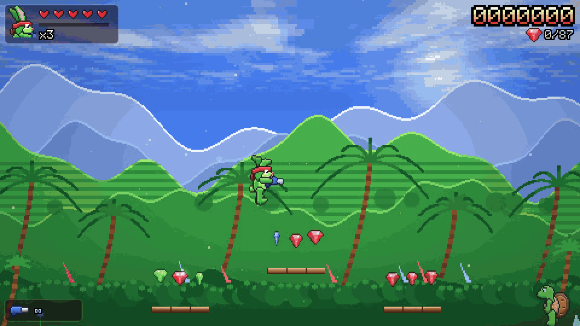

🎬 **[Watch 77 seconds of gameplay with sound (1080p60)](https://juliusbrussee.github.io/jazz-jackrabbit-remastered/media/jazz-gameplay.mp4)**

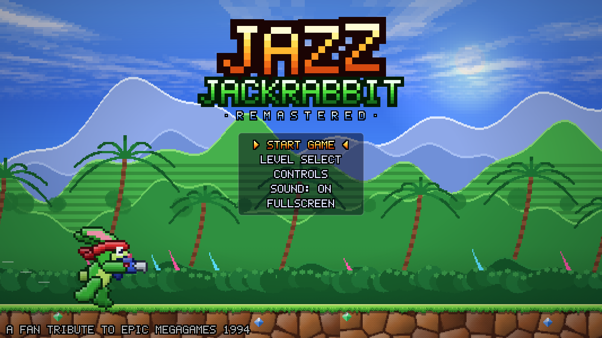

## Screenshots

| | |
|---|---|
| 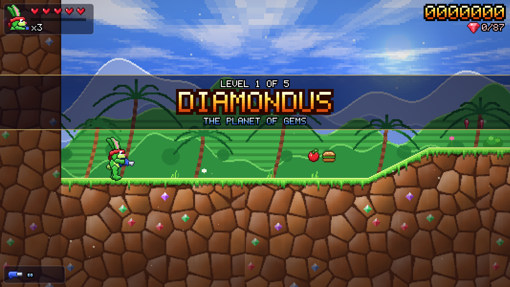 | 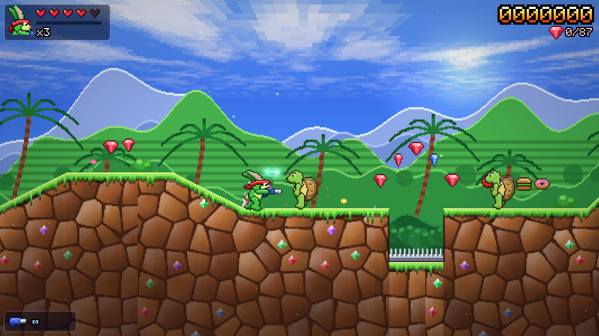 |
| **Diamondus.** Every world opens with its own title card. | Blasting turtle goons past a spike pit. Gems are set right into the rock. |
| 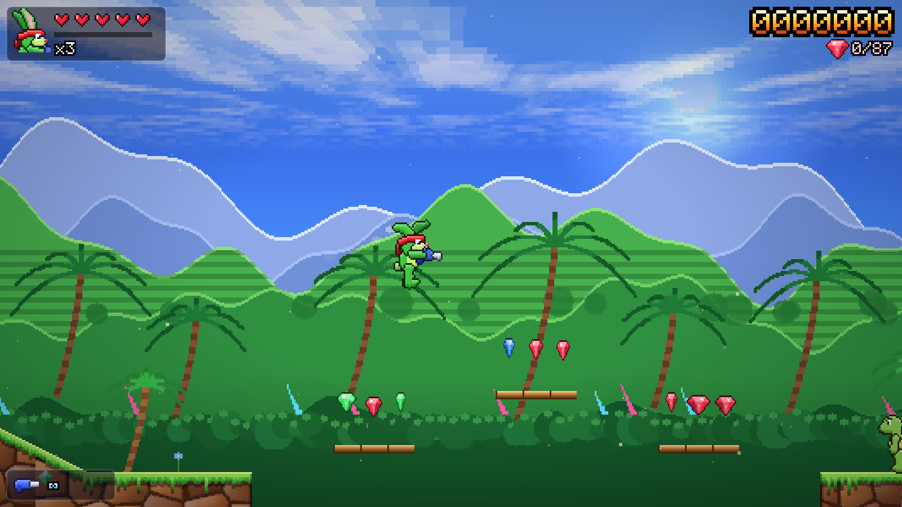 | 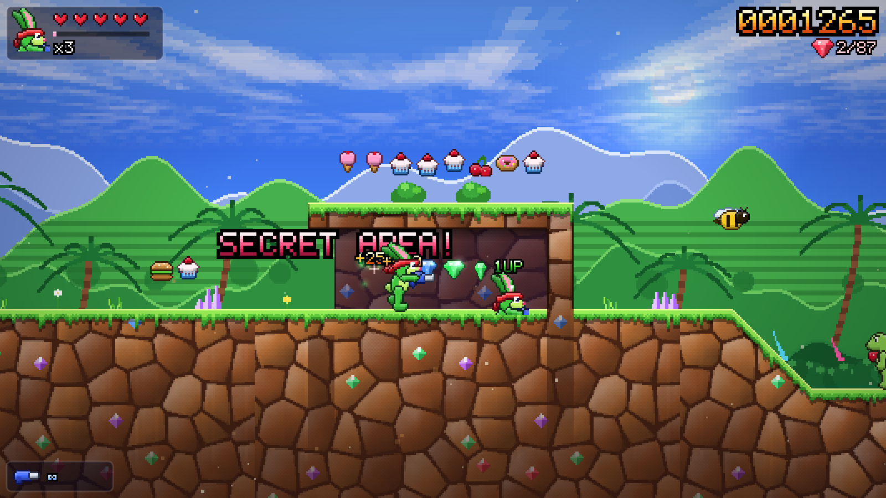 |
| Helicopter ears: press jump again in mid-air to hover. | Shoot the cracked blocks to open a hidden room with gems and a 1-UP. |
| 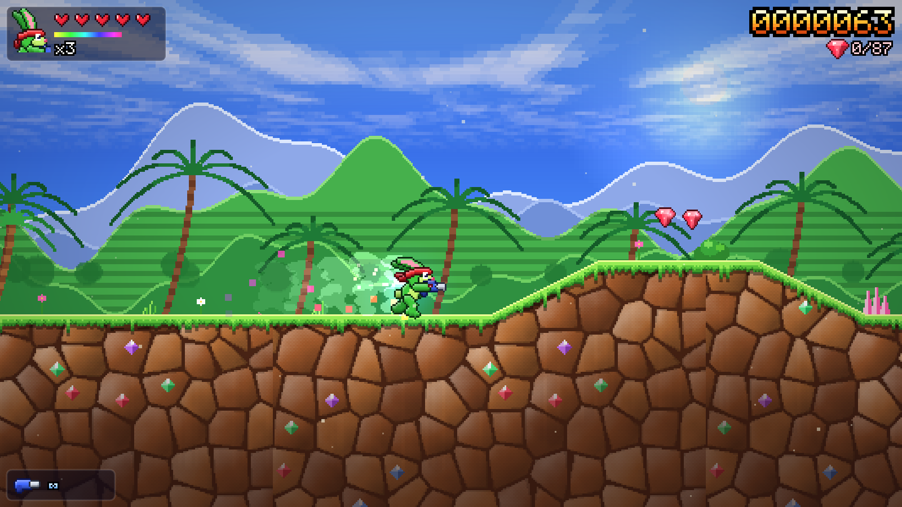 | 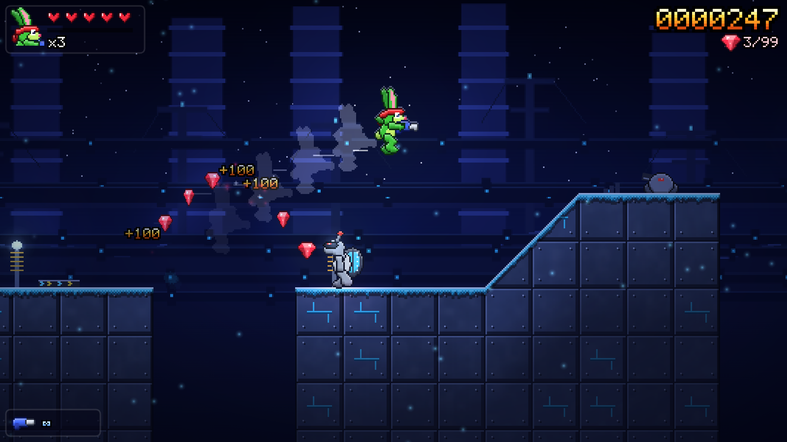 |
| Eat 60 snacks for a sugar rush: invincible, faster, and items fly to you. | **Tubelectric.** Boost pads fling Jazz across bottomless gaps. |
| 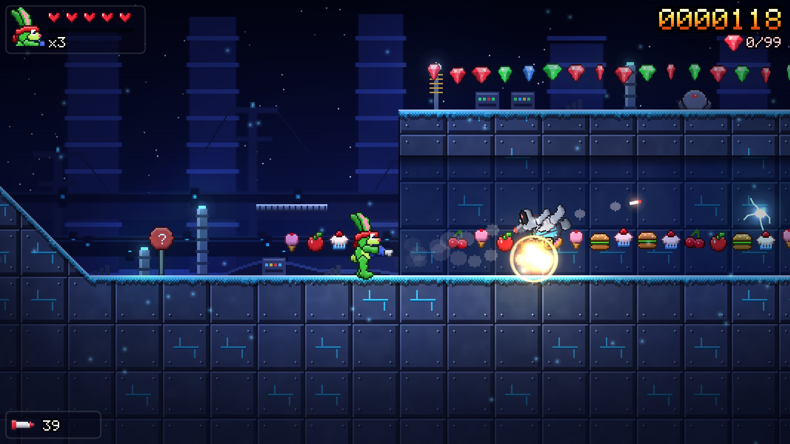 | 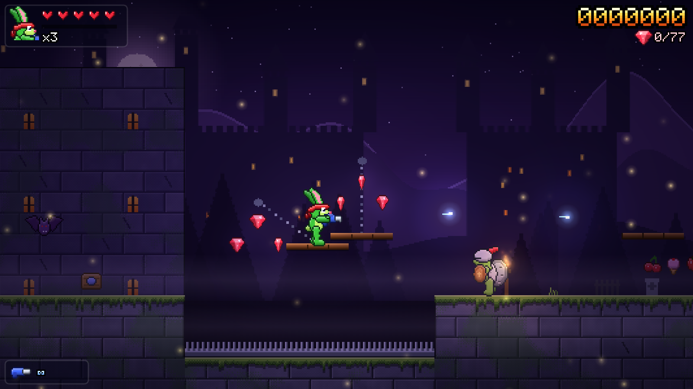 |
| RF missiles blow a robo-turtle apart. The dark worlds use dynamic lighting. | **Medivo.** Swinging platforms, torch-lit keeps, bats and firefly glow. |
| 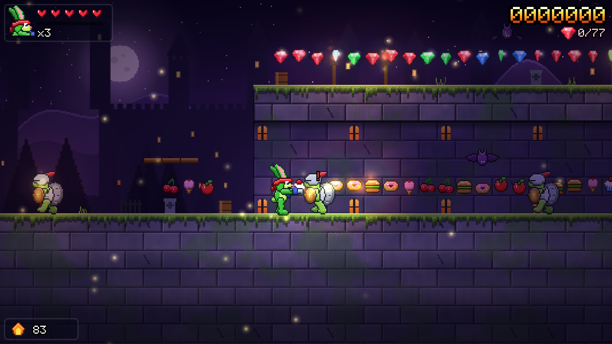 | 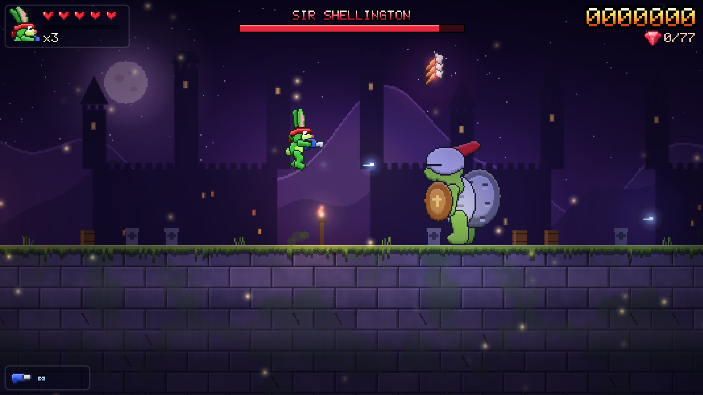 |
| The Toaster flamethrower against an armoured knight turtle. | **Boss:** Sir Shellington leaps, sends out shockwaves and throws axes. |
| 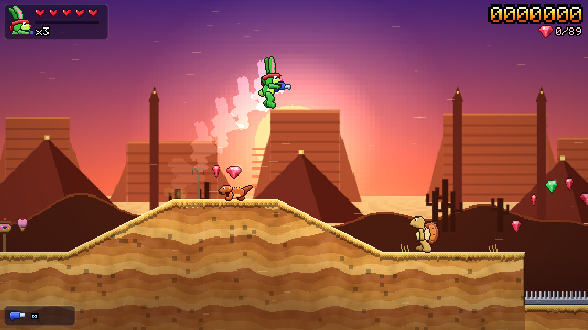 | 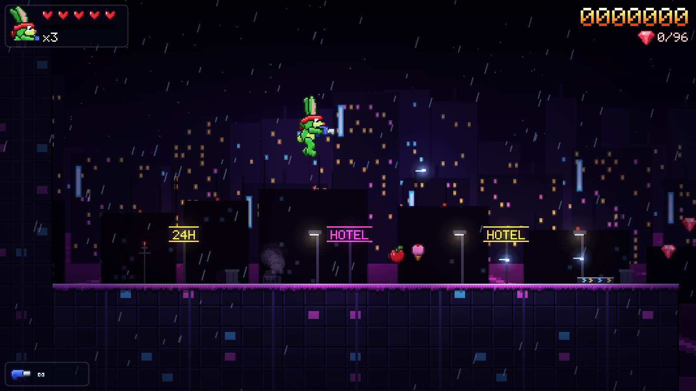 |
| **Letni.** Sprinting over sunset dunes, with afterimages at top speed. | **Technoir.** Rainy neon rooftops above a synthwave grid. |
| 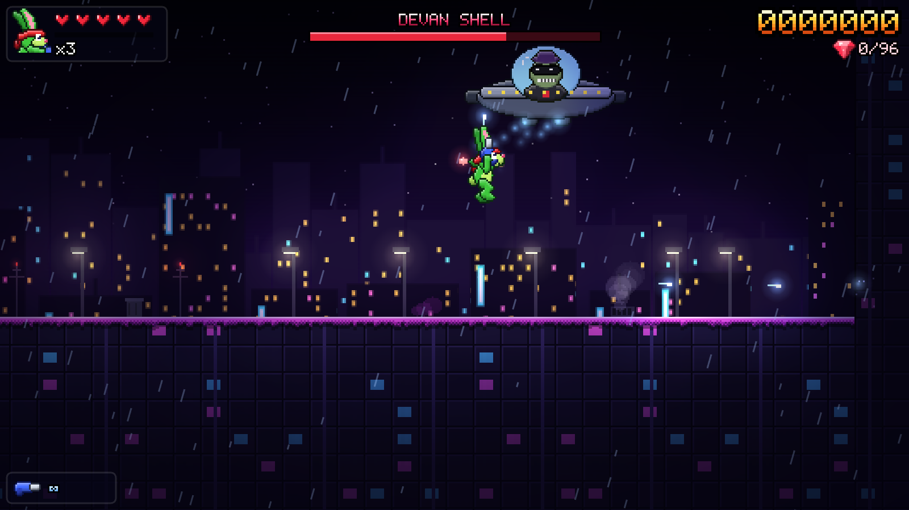 | 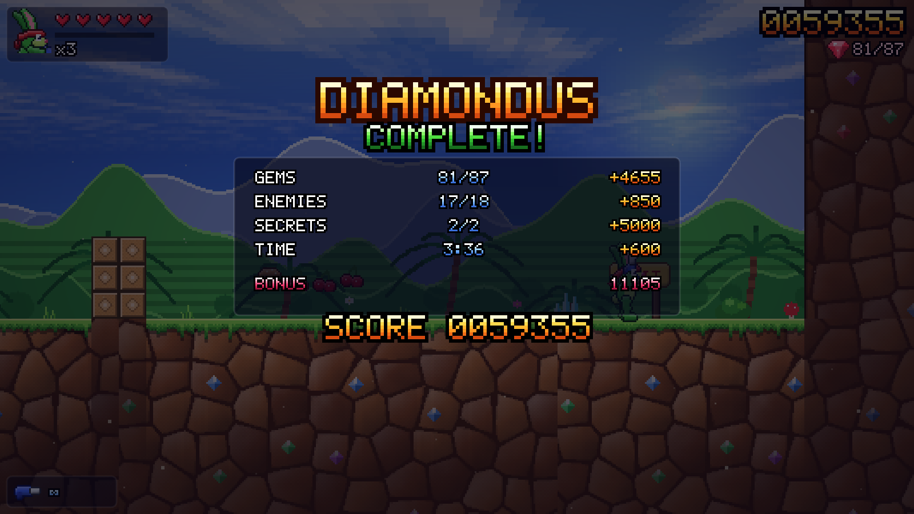 |
| **Final boss:** Devan Shell in his hover pod. Aim up and dodge the bombs. | Level tally: gems, enemies, secrets, time and a perfect bonus. |

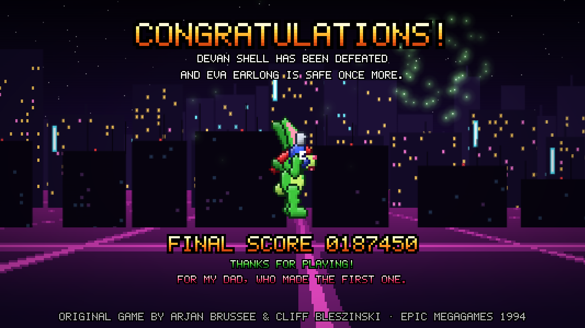

## What's in it

- 5 worlds: Diamondus, Tubelectric, Medivo, Letni, Technoir
- Bosses: Sir Shellington (Medivo) and Devan Shell (Technoir)
- Jazz moves: run and sprint, variable jump, helicopter ears, butt-stomp, drop-through platforms
- 4 weapons: Blaster (with rapid-fire upgrade), Bouncer, Toaster, RF Missiles
- Gems, food and sugar rush, carrots, 1-UPs, springs, boost pads, moving and swinging platforms, breakable blocks, hidden rooms, checkpoints
- Parallax and 3D-plane skies, dynamic lighting, weather, a synth soundtrack and sound effects
- Keyboard and gamepad

## Controls

| Key | Action |
|---|---|
| Arrows / WASD | Move, look up, crouch |
| Space / Z | Jump (hold for higher, press again in mid-air to hover) |
| Down in mid-air | Butt-stomp |
| X / J / Ctrl | Fire (hold Up to shoot up) |
| Shift | Run |
| Q / E / 1-4 | Switch weapon |
| Down + Jump | Drop through a platform |
| Esc / P · M · F | Pause · Mute · Fullscreen |

Debug: `index.html?level=3&x=120` starts at level 3, column 120.

## Disclaimer

Unofficial fan tribute. Not affiliated with or endorsed by Epic Games. Jazz Jackrabbit is a trademark of its respective owner.
